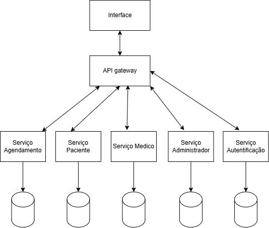

## 🎨 Design System
No contexto de arquitetura de software, um Design System é um conjunto unificado de padrões, componentes, diretrizes e práticas que guiam tanto o desenvolvimento quanto o design de interfaces e funcionalidades.

## 🏗️ Arquitetura

### Estilo Arquitetural
Adotamos o estilo Microsserviços, promovendo escalabilidade, resiliência e implantação independente dos módulos do sistema. Esse estilo se encaixa muito bem no contexto de clínicas médicas porque permite que diferentes partes do sistema funcionem de forma independente. Se uma parte precisar de manutenção, o resto continua funcionando normalmente, o que é importante em ambientes médicos, onde o sistema precisa estar disponível o tempo todo.

### Padrão Arquitetural
O padrão arquitetural adotado será o **MVC (Model-View-Controller)**, visando uma separação clara entre regras de negócio, lógica de apresentação e manipulação de dados. Isso facilita a evolução do sistema e promove um desenvolvimento mais organizado.

## Desenho Arquitetural
  
O diagrama representa o estilo arquitetural baseado em microsserviços, mediado por um API Gateway que centraliza o acesso aos diversos serviços da aplicação. A Interface do usuário se comunica exclusivamente com o API Gateway, que distribui as requisições entre os serviços especializados:

- **Serviço de Agendamento**: Responsável pela marcação e cancelamento de consultas.
- **Serviço de Paciente**: Gerencia os dados e operações relacionados aos pacientes.
- **Serviço Médico**: Manipula informações e funcionalidades relacionadas aos médicos.
- **Serviço de Administrador**: Centraliza funcionalidades administrativas como relatórios e gestão da aplicação.
- **Serviço de Autenticação**: Controla o login, cadastro e autenticação dos usuários.

Cada serviço possui seu próprio banco de dados, respeitando o princípio da descentralização de dados, característico da arquitetura de microsserviços. Os serviços não acessam diretamente os bancos de dados uns dos outros. Em vez disso, a comunicação ocorre por meio de chamadas HTTP ou mensageria entre serviços.

Por exemplo, quando um paciente deseja marcar uma consulta:

1. A requisição é enviada da Interface ao **API Gateway**.
2. O API Gateway encaminha a solicitação ao **Serviço de Paciente**, que valida os dados do paciente.
3. Em seguida, o Serviço de Paciente realiza uma **chamada ao Serviço de Agendamento**, solicitando a criação de um novo agendamento.
4. O Serviço de Agendamento, por sua vez, **acessa exclusivamente seu próprio banco de dados** para gravar os dados da consulta.

Esse modelo garante **independência entre os serviços**, melhorando a escalabilidade, manutenção e segurança. Todas as dependências entre serviços são mediadas por **contratos de API bem definidos**, sem acoplamento direto entre os bancos de dados.

### Identidade Visual

#### Paleta de Cores

| Nome | Código HEX | Uso Principal |
|------|------------|---------------|
| Primária | #007E85 | Botões, links, bordas |
| BlackLight | #1C1B1F | Bordas de inputs e placeholders |
| Neutro claro | #C3C3C3 | Textos principais |
| Black | #000000 | Textos principais |
| Error | #EE0202 | Erros, alertas críticoss |
| White | #FFFFFF | Backgrounds da tela e de cards |

#### 🖋️ Tipografia

| Tipo | Fonte Principal | Peso | Uso |
|------|----------------|------|-----|
| Títulos | Poppins | Bold | Textos principais |
| Corpo | Poppins | SemiBold | Textos botoes e links|
| Auxiliar | Poppins | Regular | Textos secundarios, fonte dos inputs |

### Componentes UI

#### Botões

| Variante | Cor | Borda | Texto | Uso |
|----------|-----|-------|-------|-----|
| Primário | #2A9D8F | 4px | Branco | Ações principais (ex: criar conta, login confirmar) |
| Secundário | #EE0202 | 15px | Branco | Ações de exclusão e cancelamento |
| Desabilitado | #D1D5DB | Não | #9CA3AF | Estados inativos |

#### Inputs
- Bordas arredondadas 8px
- Altura: 66px
- Placeholder em cinza (#1C1B1F)
- Types: Text, Password, Email, Date, Select

#### Cards
- Fundo: #FFFFFF
- Borda: 1px sólida #007E85
- Bordas arredondadas 10px
- Espaçamento interno: 16px

### 🧭 Ícones
- Tamanho padrão: 24px
- Cores: herdam cor do texto

#### Tabela de Ícones do Sistema

| Ícone | Nome | Uso |
|-------|------|-----|
|  | Fechar | Usado para fechar modais, popups e painéis |
| .png) | Home | Usado para navegar para a tela principal do sistema. |
|  | Home disable | Usado para indicar quando a tela principal do sistema nao estiver em foco |
| .png) | Consulta | Usado para navegar para a tela de agendamento de consulta |
| .png) | User | Usado para navegar para a de "perfil do usario". |
| .png) | User disable | Usado para indicar quando a tela de "perfil do usario"  nao estiver em foco |

#### Figma (identidade visual)
https://www.figma.com/design/jx09dLrSN39Vk5C2C2gNGQ/Trabalho-Arquitetura?node-id=0-1&p=f&t=p98Jdmk2imyMfsq0-0 

### 👥 Jornada do Usuário

#### Médico
- Se cadastra
- Visualização da agenda de consulta
- Cancela agendamento

#### Paciente
- Se cadastra
- Agenda consulta
- Consulta agendamento
- Cancela agendamento

#### Admin
- Gerenciamento de agendamentos
- Emissão de relatórios
- Cancela Consulta

#### Figma (jornada do usuário)
https://www.figma.com/design/b9HuaHdyiE8sYG3BYNUW3a/Untitled?node-id=0-1&p=f&t=uvlOPM4u5bNzP3ZR-0

## 🛠️ Tecnologias

## Frontend
- **React**: Framework principal para desenvolvimento do frontend
- **MUI**: Para estilização e design responsivo
- **Axios**: Para comunicação com a API

## BackEnd
### Requisitos de Segurança
- *OAuth2*: Utilizado para autenticação e autorização segura dos usuários.
- *HTTPS*: Protocolo de comunicação para garantir a segurança dos dados transmitidos.
- *JWT (JSON Web Tokens)*: Para gerenciar sessões de usuários de forma segura.

### Protocolo de Comunicação
- *API REST*: Utilizaremos HTTP para comunicação entre os serviços.

### Tecnologias Utilizadas
- *Java com Spring Boot (versão 21)*: Framework principal para desenvolvimento do backend.
- *JPA (Java Persistence API)*: Para comunicação com o banco de dados.
- *Lombok*: Para reduzir a verbosidade do código e agilizar o desenvolvimento

## Banco de Dados
- **MySql**: Escolhido pois atende os requisitos do sistema, possui um baixo custo, e é facil em caso de manuntenção. Alem disso o sistema nao tem necessidade da complexidade de um banco não relacional

### Nomenclatura

- **Tabelas**: nomes no plural, com inicial maiúscula, representando entidades do domínio (ex: `Usuarios`, `Pacientes`, `Consultas`).

###  Tabela `Usuarios`

| Campo       | Tipo            | Restrições | Descrição                            |
|-------------|------------------|------------|----------------------------------------|
| id_usuario  | INT              | PK         | Identificador único do usuário        |
| nome        | VARCHAR(100)     | -          | Nome completo do usuário              |
| email       | VARCHAR(100)     | UNIQUE     | E-mail do usuário (único)             |
| senha       | VARCHAR(255)     | -          | Senha (armazenada com hash)           |

---

###  Tabela `Pacientes`

| Campo       | Tipo  | Restrições | Descrição                          |
|-------------|--------|------------|------------------------------------|
| id_usuario  | INT    | FK         | Referência ao usuário              |

---

###  Tabela `Medicos`

| Campo       | Tipo         | Restrições | Descrição                          |
|-------------|---------------|------------|------------------------------------|
| id_usuario  | INT           | FK         | Referência ao usuário              |
| crm         | VARCHAR(20)   | -          | Número do CRM do médico            |

---

###  Tabela `Administradores`

| Campo       | Tipo  | Restrições | Descrição                          |
|-------------|--------|------------|------------------------------------|
| id_usuario  | INT    | FK         | Referência ao usuário              |

---

###  Tabela `Consultas`

| Campo        | Tipo                               | Restrições | Descrição                           |
|--------------|------------------------------------|------------|-------------------------------------|
| id_consulta  | INT                                | PK         | Identificador único da consulta     |
| data_hora    | DATETIME                           | -          | Data e hora da consulta             |
| status       | ENUM('Agendada','Cancelada','Realizada') | -    | Estado atual da consulta           |
| id_paciente  | INT                                | FK         | Referência ao paciente              |
| id_medico    | INT                                | FK         | Referência ao médico                |

---

###  Tabela `Especialidades`

| Campo            | Tipo          | Restrições | Descrição                            |
|------------------|---------------|------------|----------------------------------------|
| id_especialidade | INT           | PK         | Identificador único da especialidade   |
| nome             | VARCHAR(100)  | -          | Nome da especialidade médica           |

## Governança do Design System

A governança do Design System é essencial para assegurar sua consistência, evolução contínua e adoção adequada pelas equipes. Para o Sistema de Gestão de Consultas Médicas, estabelecemos as seguintes diretrizes:

### Responsáveis

- **Squad de Design System**: formado por representantes de design, frontend e arquitetura.
- **Designers e Desenvolvedores de cada squad**: responsáveis por propor novos componentes e colaborar com manutenções.

### Processo de Atualização

1. **Proposição**: novos componentes ou alterações são sugeridos via Pull Request em repositório dedicado.
2. **Revisão**: a equipe de governança avalia a aderência às diretrizes de acessibilidade, responsividade, padronização e reuso.
3. **Documentação**: cada alteração aceita deve ser documentada no Storybook e registrada no Notion com data e responsáveis.
4. **Publicação**: os componentes aprovados são publicados via **npm** e disponibilizados para todos os serviços no monorepo via **Turborepo**.

### Boas Práticas

- Nomeação clara e consistente de componentes.
- Testes automatizados para todos os componentes (visuais e unitários).
- Revisões quinzenais do sistema para identificar componentes obsoletos ou duplicados.
- Alinhamento com tokens de design centralizados.

### Ciclo de Revisão

- **Mensal**: revisão geral da biblioteca para garantir consistência.
- **Semestral**: atualização de tokens de identidade visual, quando necessário.
- **Sob demanda**: atualização de componentes com base em feedbacks das equipes ou necessidade de novos fluxos.

